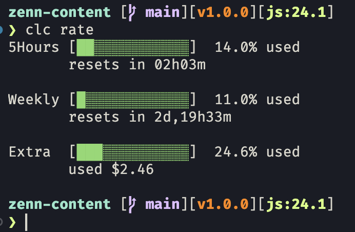

# clc - Claude Code レート残量表示 CLI


`clc rate` を叩くだけで Claude Code のレート残量(5時間枠/週間枠/追加課金枠)を表示する CLI ツールです.
ちなみに`clc`は"Claude Code"の略.

Python3.13にて, 外部パッケージなしで開発しました.

```sh
❯ clc rate
5Hours [██░░░░░░░░░░░]  17.0% used
       resets in 01h59m

Weekly [█░░░░░░░░░░░░]   4.0% used
       resets in 6d,39m

Extra  [███░░░░░░░░░░]  24.6% used
       used $2.46

```



- 使用率に応じてバーが色分けされます.
- 見た目や表示内容のカスタマイズは, `config.json` を編集するだけで可能です.
- `clc xxx` のように他のコマンドを追加することも可能です.
  - 反対に, `clc` だけで`clc rate`を叩くようにすることも容易に可能です. (.zshrcにaliasを追加する等)

## 注意
短時間に何度も叩くと, すぐにAPIレートリミットに引っかかったので注意してください.

## 必要環境

- macOS Tahoe 26.5 で動作確認 (Windows, Linux でも動くはず)
- Python 3 (標準ライブラリのみ. 外部パッケージ不要)
- Claude Code にログイン済みであること
  (OAuth トークンを Keychain の `Claude Code-credentials`, なければ
  `~/.claude/.credentials.json` から読み取ります)

## インストール

リポジトリ直下の実行可能スクリプト `clc` を PATH に通します. どちらか好きな方法で:

```sh
# 方法1: symlink (~/bin が PATH に入っている場合)
ln -s "$(pwd)/clc" ~/bin/clc

# 方法2: .zshrc に alias を追加
echo "alias clc='$(pwd)/clc'" >> ~/.zshrc && source ~/.zshrc
```

## 使い方

```sh
clc rate          # レート残量を表示
clc rate --json   # API の生レスポンスを JSON で表示
```

常時表示したい場合 (macOS)
```sh
brew install watch
watch -n 60 clc rate  # 60秒ごとにレート残量を表示
```

## カスタマイズ (config.json)

リポジトリ直下の `config.json` を編集することで表示をカスタマイズできます.

| キー                     | デフォルト値                      | 説明                                                             |
| ------------------------ | --------------------------------- | ---------------------------------------------------------------- |
| `bar_width`              | `13`                              | プログレスバーの文字数                                           |
| `label_width`            | `7`                               | ラベル列の表示幅(半角換算)                                       |
| `monthly_limit_usd`      | `10.0`                            | Extra枠の月間上限額(USD). ご自身のClaudeの設定に合わせてください |
| `color_warn_threshold`   | `50`                              | この使用率(%)以上で黄色表示                                      |
| `color_danger_threshold` | `80`                              | この使用率(%)以上で赤表示                                        |
| `window_labels`          | `{"five_hour": "5Hours", ...}`    | 各ウィンドウの表示名                                             |
| `window_order`           | `["five_hour", "seven_day", ...]` | ウィンドウの表示順                                               |

`config.json` が存在しない場合はすべてデフォルト値で動作します.
また, `config.json` に書いたキーだけが上書きされ, 省略したキーはデフォルト値のままです.

## エラーになる場合

- 「認証情報が見つかりません」「トークンの有効期限が切れています」
  → Claude Code を一度起動するとトークンが保存・更新されます.
  → または, ClaudeにWeb上でログインすると解消できます.

※ 本ツールはClaude Code内部のOAuth APIを利用しており, 公式のAPIではありません. 将来的に仕様変更や廃止の可能性があります.

## 仕組み

`https://api.anthropic.com/api/oauth/usage` に OAuth トークン(`anthropic-beta: oauth-2025-04-20` ヘッダ付き)で GET し, `five_hour` / `seven_day` 各ウィンドウの `utilization`(使用率%)と `resets_at`(リセット時刻)を整形して表示します.

### extra_usage について

自分の場合, 月に10$までに追加クレジット利用を制限しています(monthly_limitの値).
なので例えば, 24.6% used なら今月はあと7.54$使えるということです.

```json
"extra_usage": {
    "is_enabled": true,
    "monthly_limit": 1000,
    "used_credits": 246.0,
    "utilization": 24.6,
    "currency": "USD",
    "decimal_places": 2,
    "disabled_reason": null,
    "daily": null,
    "weekly": null
  },
```


## 参考
https://qiita.com/tatsuya582/items/5ca0c12a8495530f7d09

